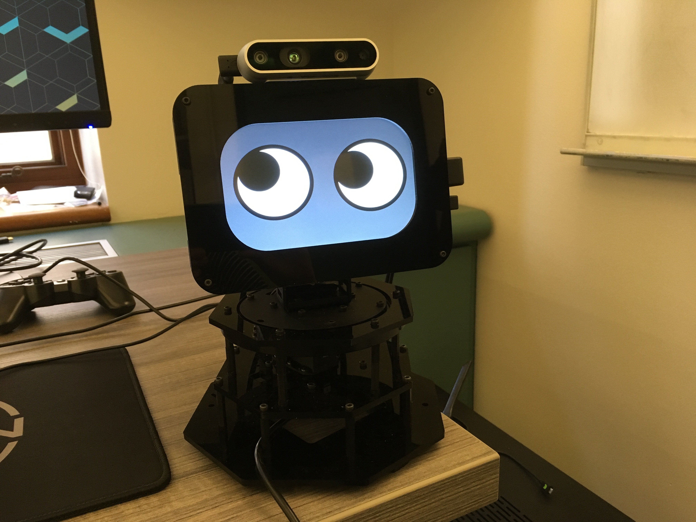

.. shutter-ros documentation master file, created by
   sphinx-quickstart on Thu May 30 20:25:22 2019.
   You can adapt this file completely to your liking, but it should at least
   contain the root `toctree` directive.

Shutter-ROS
===========

Collection of `ROS packages <http://www.ros.org/>`_ to get started using the Shutter robot.
The robot was created by the `Interactive Machines Group <https://interactive-machines.com/>`_
at `Yale University <http://www.yale.edu>`_.

More information about Shutter, including how to build your own robot, is located on the `main Shutter project website <https://shutter.interactive-machines.com>`_.

.. include:: ../../INSTALL.md
   :parser: myst_parser.sphinx_

.. toctree::
   :maxdepth: 2
   :hidden:
   :caption: Packages

   packages/shutter_bringup
   packages/shutter_description
   packages/shutter_face
   packages/shutter_hardware_interface
   packages/shutter_moveit_config
   packages/shutter_opt_control
   packages/shutter_servo
   packages/shutter_teleop
   packages/rqt_shutter_plugins

