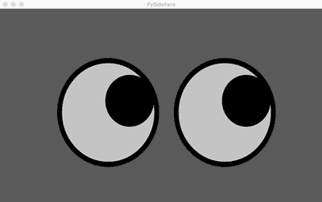
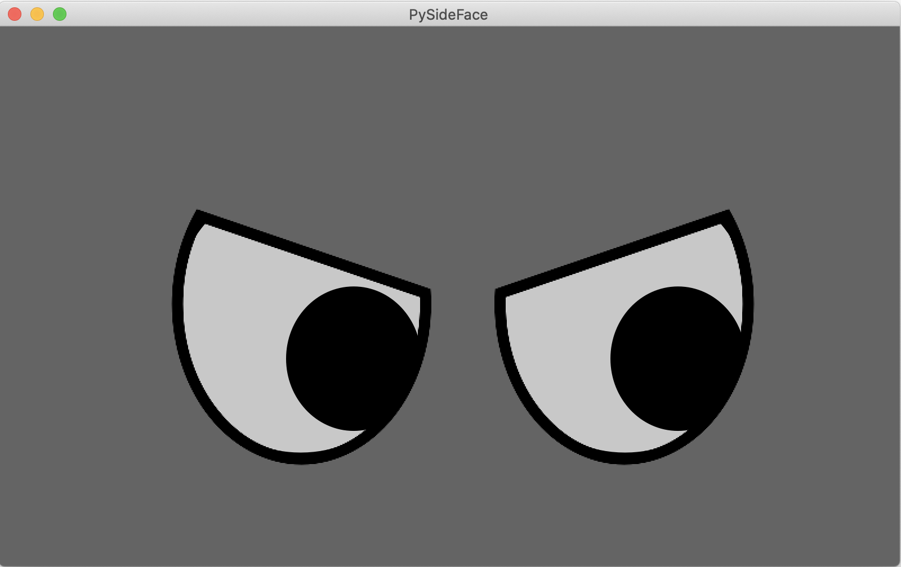

# Shutter Face

A simple robot face built in Python 3 with [PySide2](https://wiki.qt.io/Qt_for_Python).

# Quick Start

0. Install [pyenv](https://github.com/pyenv/pyenv#installation) and [pipenv](https://pipenv.pypa.io/en/latest/#install-pipenv-today) by following their respective instructions.

1. Install the shutter-face package. You may be prompted to install the correct version of Python (as of this writing, version 3.8.x)
    ```bash
   # cd shutter-face # this repository
   $ export PIPENV_VENV_IN_PROJECT=true
   $ pipenv install
    ```

2. Run demo

    ```bash
   # cd shutter-face # this repository
   $ pipenv run interactive_face
   ```
   
   You should then be able to see the face show up in a window:
   
   
   
   Move the mouse on top of the window to change gaze direction.
   Press the keys 1 through 7 to change facial expressions 
   (0 to go back to neutral).  For example, pressing 1 makes
   the robot look angry:
   
   

   You can view other options for running the demo by invoking the `--help` flag:

   ```bash
   $ pipenv run interactive_face --help
   ```

   For example, to view the face at the resolution of the newer screen, and disable the blinking behavior:

   ```bash
   $ pipenv run interactive_face --version v2 --disable-blink
   ```

   Note that the screen version must be specified as a string, either `v1` or `v2`, and not as an integer!!
   
# Code Organization

The code is organized as follows:

```
shutter-face/
|   README.md                               # documentation
|   LICENSE                                 # code license
|   setup.py                                # setup script for installing the shutter_face package
|   ...
|
|-- demos/                                  # demos folder
|   |   simple_face_interactive.py          # mouse and keyboard demo
|   |   ...
|
|-- shutter_face/                           # main package
|   |-- data/                               # media for rendering the face
|   |   face_params.py                      # fixed params for shutter's face
|   |   flat_face.py                        # simple flat face for the robot
|   |   ...
|
|-- docs/                                   # documentation files (e.g., images)
```


# Updating the Face Dimensions and Expressions

The dimensions for Shutter's face and eyes are specified with a [Dataclass](https://docs.python.org/3/library/dataclasses.html) object `FaceParams`.
It is recommended to define the parameters for a new screen resolution in `shutter_face/face_params.py`:

```python
# shutter_face/face_params.py
fp_v1 = FaceParams(width=800,
                   height=480,
                   horizontal_offset=12,
                   eye_scale=0.3,
                   pupil_scale=0.5,
                   separation_scale=0.6,
                   fx=40,
                   fy=40,
                   expressions=expr_v1)
```

Note that the expressions are specified via a dictionary of `Expression` dataclass objects.
Shutter's facial expressions are implemented by rendering SVG masks (located in `shutter_face/data`) over the eyes.
The masks are positioned and scaled with handcrafted values, which are also located in [shutter_face/face_params.py](./shutter_face/face_params.py).
In particular, the expression parameters are specified with a Dataclass object called `Expression`, that defines the following fields:

+ `left_x, right_x`: x-axis coordinates for the left and right eye QLabel [setGeometry](https://doc.qt.io/qtforpython-5/PySide2/QtWidgets/QWidget.html#PySide2.QtWidgets.PySide2.QtWidgets.QWidget.setGeometry)
+ `y`: y-axis coordinate for QLabel [setGeometry](https://doc.qt.io/qtforpython-5/PySide2/QtWidgets/QWidget.html#PySide2.QtWidgets.PySide2.QtWidgets.QWidget.setGeometry)
+ `w, h`: width and height specifiers for QLabel [setGeometry](https://doc.qt.io/qtforpython-5/PySide2/QtWidgets/QWidget.html#PySide2.QtWidgets.PySide2.QtWidgets.QWidget.setGeometry)
+ `scale_w, scale_h`: width and height scaling factors for QPixmap [scaled](https://doc.qt.io/qtforpython-5/PySide2/QtGui/QPixmap.html#PySide2.QtGui.PySide2.QtGui.QPixmap.scaled)

To define new parameters for a given expression, just create a new instance of `Expression` in `face_params.py`:

```python
expr_v1 = {'angry': Expression(left_x=142, right_x=430, y=-99, w=490, h=690, scale_w=500, scale_h=297),
           'bored': Expression(left_x=142, right_x=430, y=-99, w=490, h=690, scale_w=500, scale_h=297),
           'determined': Expression(left_x=142, right_x=430, y=-99, w=490, h=690, scale_w=500, scale_h=297),
           'happy': Expression(left_x=141, right_x=430, y=-87, w=490, h=690, scale_w=255, scale_h=275),
           'happy2': Expression(left_x=142, right_x=430, y=-86, w=490, h=690, scale_w=255, scale_h=274),
           'sad': Expression(left_x=142, right_x=430, y=-86, w=490, h=690, scale_w=252, scale_h=275),
           'surprised': Expression(left_x=119, right_x=406, y=-88, w=490, h=690, scale_w=300, scale_h=270)}
```

Note that some of the values are common across all expressions for a given screen resolution, for example the QLabel width and height geometry.
These common values could be adjusted as internal parameters in `face_params.py`, depending on future implementation.

For both `FaceParams` and `Expression` dataclasses, it is recommended to enumerate all parameters with keyword arguments.